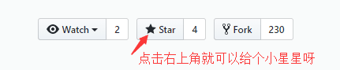

## 告白气球

> 塞纳河畔，左岸的咖啡。告白气球，飞入我的心扉。 

> <b>修改config.js的配置就可以为您心爱的人做一个超具创意的网页版告白气球哦, 喜欢的话给个小星星呗~</b>



### TODO
* [x] 添加背景音乐

### config.js 说明
> 温馨提示: 每句话那一行，最后都要以**英文逗号**结尾哦！

> 背景音乐没有使用告白气球, 而是颜人中的晚安，因为最近很喜欢这首歌。如果替换音乐请替换 `static/wanan-yanrenzhong.mp3`文件，记住文件名不能替换哦！
```text
var config = {
    // 句子的长度可以任意， 你可以写十句话， 二十句话都可以
    // 每句话尽量不要超过15个字,不然展示效果可能不太好
    texts: [
        "送给我",      //这里,每句话结尾的最后一个逗号必须是英文的哦!! 很重要哦!!
        "心爱的小可爱",  // 同上...
        "今天是你的生日",
        "这是我们在一起的",
        "第三个生日了哦",
        "去年的生日",
        "还记得在王婆串串吃的呢",
        "今年要吃好的喽哦",
        "要把我家可爱猪猪喂饱饱",
        "然后抱走",
        "YAMI~~",
    ],
    wish: "小可爱&&大傻子相爱了",  //这里,每句话结尾的最后一个逗号必须是英文的哦!! 很重要哦!!
    // 时间的格式很重要哦，一定要是下面这个格式!!
    // 年年年年-月月-日日 时时:分分:秒秒
    time: "2017-07-20 0:0:0",    //这里,每句话结尾的最后一个逗号必须是英文的哦!! 很重要哦!!
};

```


## 截图演示


## 结尾
喜欢的话关注一下[霸都丶傲天](https://github.com/ajlovechina)呗~  \
定期更新一下爱情网页模板,简历模板,知识笔记,PDF书籍,原创深度技术分享等 :heart:

* 知乎:[霸都丶傲天](https://www.zhihu.com/people/AJLoveChina)
* Github:[霸都丶傲天](https://github.com/ajlovechina)

## 链接
* [第一期:爱情树 🌴将相爱的时刻永远珍藏 （微信，QQ可完美查看）](https://github.com/AJLoveChina/LoveTree)
* [第二期: :cake:改改数据,为心爱的人做一个超具创意的网页生日祝福吧~ (生日快乐)](https://github.com/AJLoveChina/birthday)
* [第三期: :balloon:塞纳河畔，左岸的咖啡。告白气球，飞入我的心扉。](https://github.com/AJLoveChina/loveBalloon)
